# Screenshots

<h2>Login</h2>
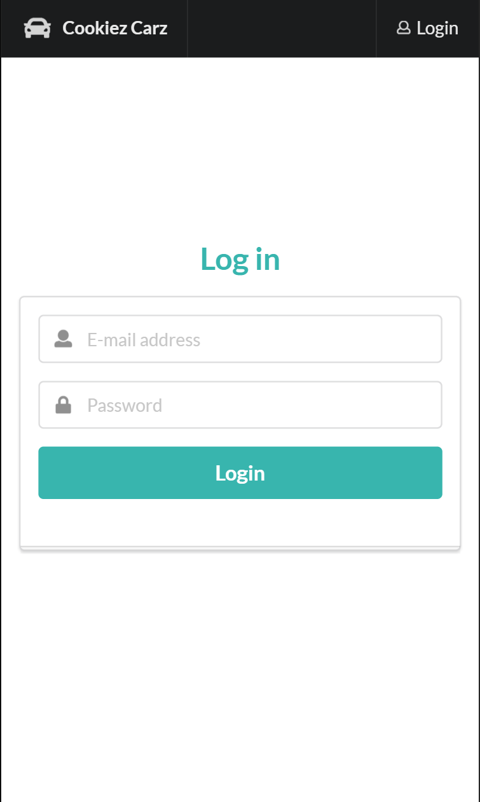

<h2>Files Folder</h2>
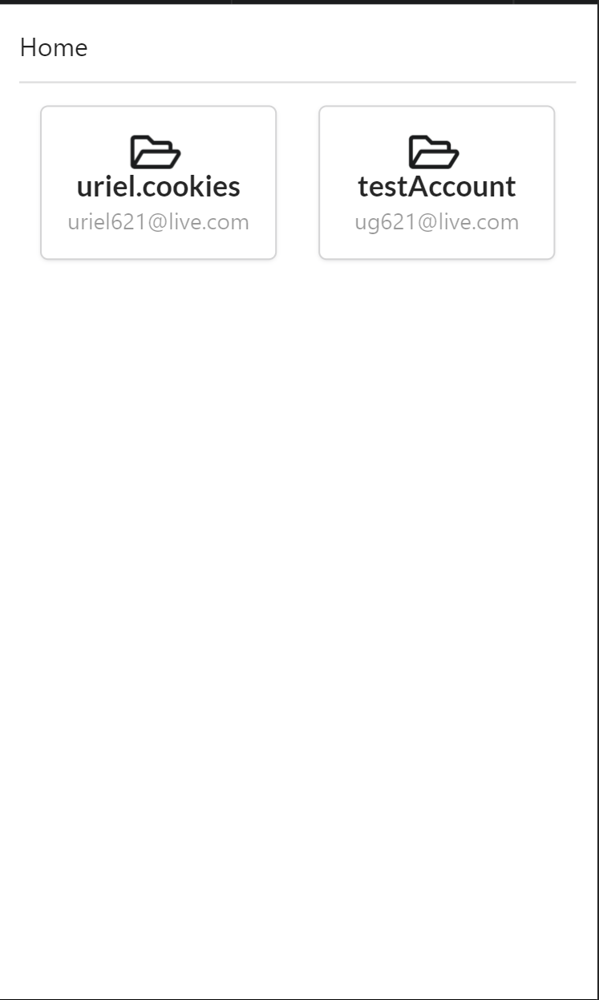

<h2>Inventory List</h2>
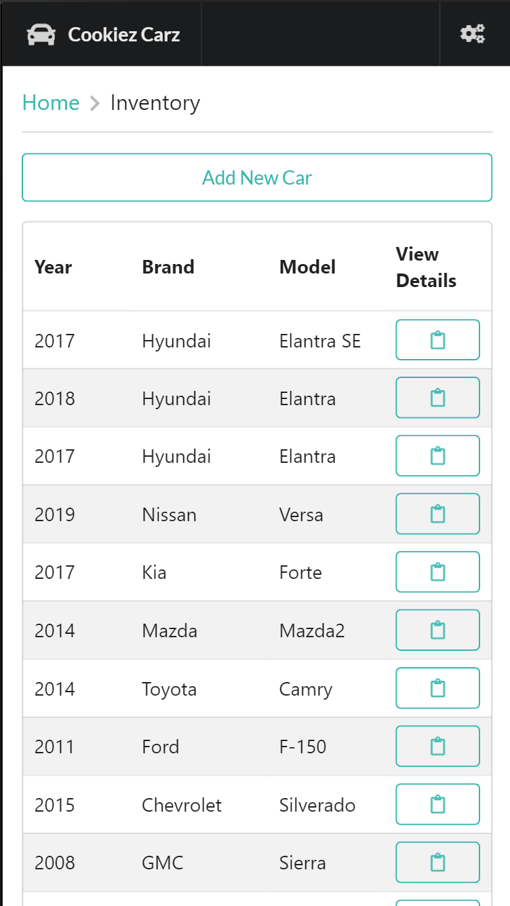

<h2>Adding New Car</h2>
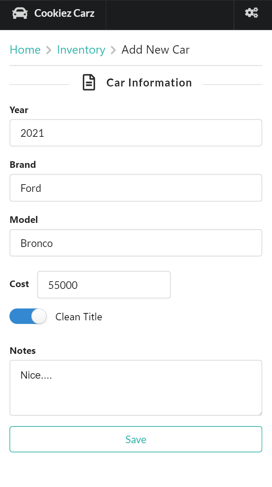

<h2>Car Information</h2>
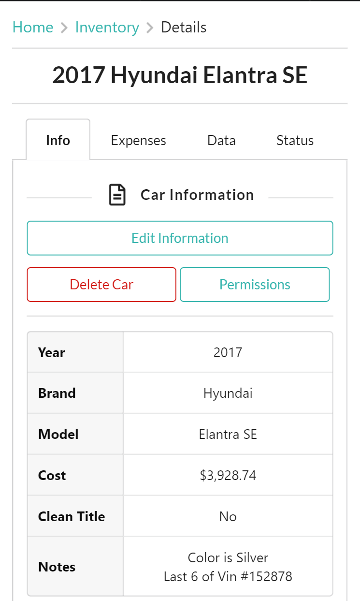

<h2>Car Information (Update)</h2>
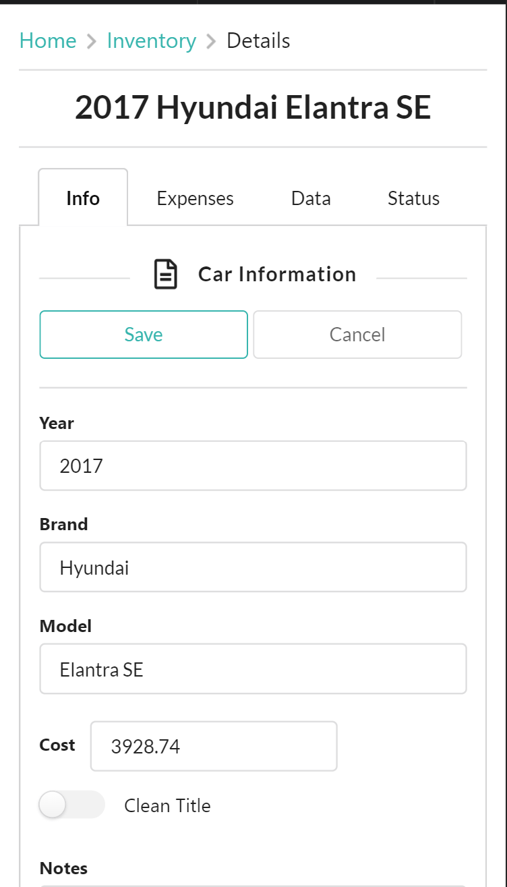

<h2>Car Information (Delete)</h2>
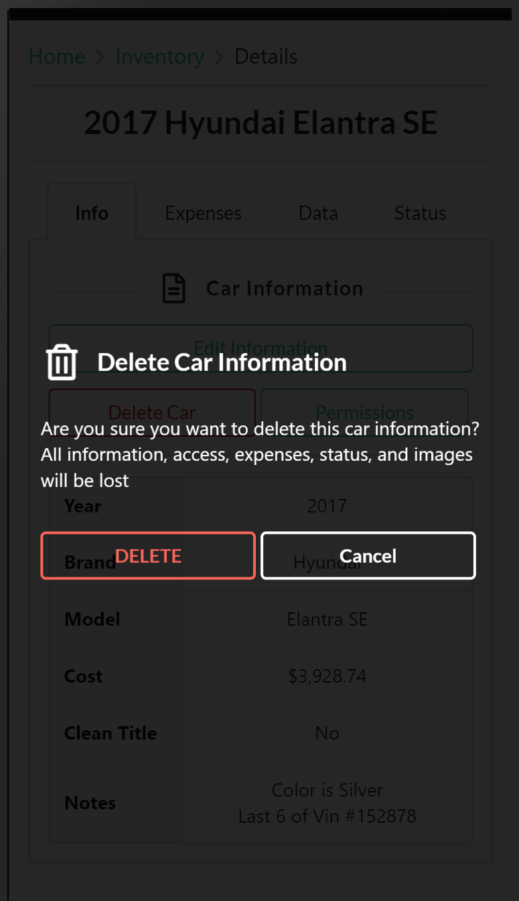

<h2>Car Information (Permissions)</h2>
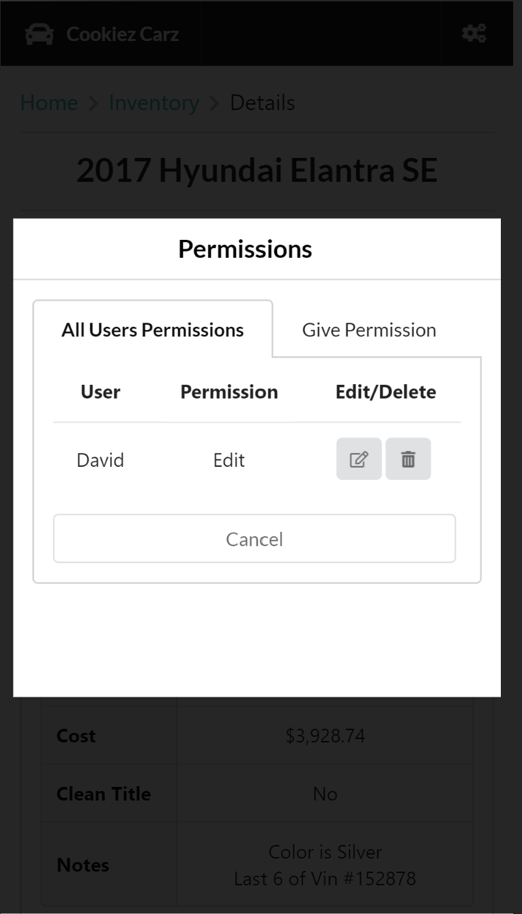

<h2>Car Expenses</h2>

<h2>Car Expenses (Add Expense)</h2>
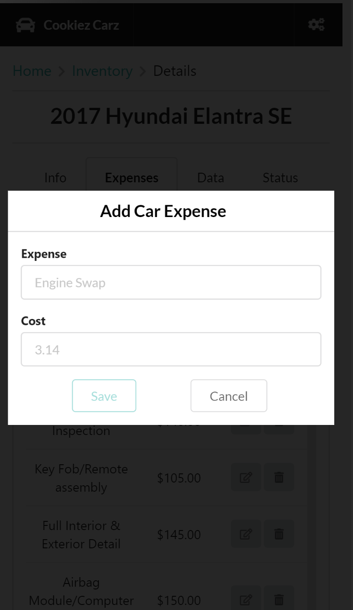

<h2>Car Data</h2>
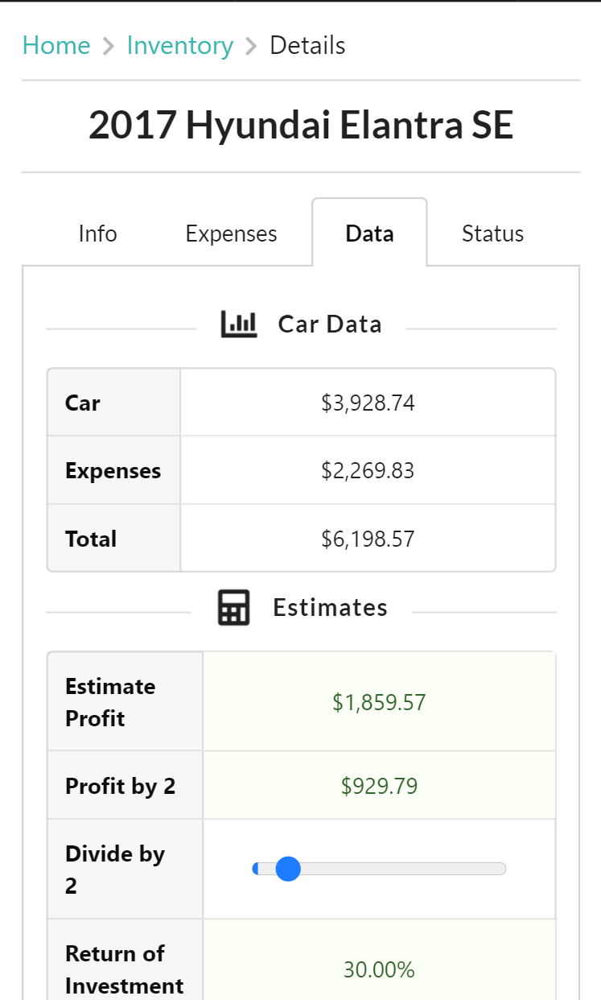

<h2>Car Status</h2>
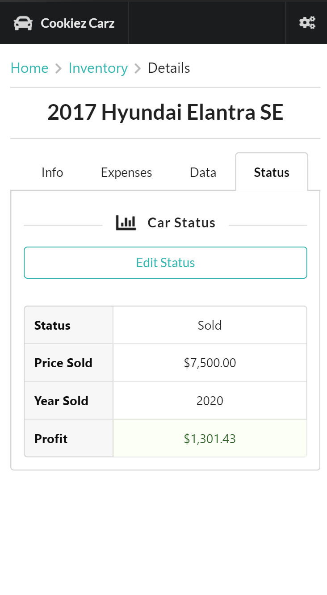
